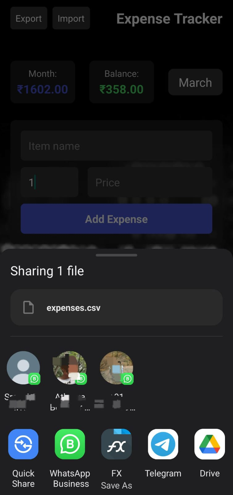

# Expense Tracker App

A simple yet powerful mobile application for tracking daily expenses, built with React Native and Expo.

## App Screenshots

<div align="center">
  <div style="display: flex; flex-wrap: wrap; justify-content: center; gap: 10px;">
    
    
    
  </div>
</div>

## Features

- **Dark Theme Interface**: Sleek, modern dark-themed UI for comfortable viewing in any lighting condition
- **Monthly Expense Tracking**: Easily track and filter expenses by month
- **Detailed Expense Records**: Add, edit, and delete expenses with name, quantity, and price
- **Expense Summaries**: 
  - View monthly expense totals
  - Track overall balance with income management
  - See remaining balance after expenses
- **Data Import/Export**: 
  - Export expenses to CSV files for backup or analysis
  - Import expenses from properly formatted CSV files
- **Responsive Design**: Well-optimized for various screen sizes and notch displays
- **Income Management**: Add to your balance to track how much money remains after expenses

## Technology Stack

- React Native
- Expo
- AsyncStorage for local data persistence

## Installation

1. Clone the repository:
   ```
   git clone https://github.com/yourusername/expense-tracker.git
   cd expense-tracker
   ```

2. Install dependencies:
   ```
   npm install
   ```

3. Start the development server:
   ```
   npm start
   ```

4. Run on your device:
   - Scan the QR code with the Expo Go app (Android) or the Camera app (iOS)
   - Or press 'a' to run on an Android emulator or 'i' to run on an iOS simulator

## Building for Production

To build a standalone APK:

1. Configure your app.json (already done)
2. Install EAS CLI:
   ```
   npm install -g eas-cli
   ```
3. Build the app:
   ```
   eas build -p android --profile preview
   ```

## Usage

### Adding Expenses
1. Select the desired month from the month selector
2. Enter expense details in the form (name, quantity, price)
3. Tap "Add Expense"

### Managing Income
1. Tap on the balance display in the middle of the screen
2. Enter the amount you want to add to your balance
3. Your remaining balance will automatically update considering all expenses

### Exporting/Importing Data
- Tap "Export" to save your expense data as a CSV file
- Tap "Import" to load expense data from a previously exported CSV file

## CSV Format

The app uses the following CSV format for import/export:

```
id,name,quantity,price,month,date
1689245781234,Groceries,2,1500.50,January,2023-01-15T10:30:00.000Z
```

Required headers: `id`, `name`, `quantity`, `price`, `month`, `date`

## License

This project is licensed under the MIT License - see below for details:

```
MIT License

Copyright (c) 2023 [Your Name]

Permission is hereby granted, free of charge, to any person obtaining a copy
of this software and associated documentation files (the "Software"), to deal
in the Software without restriction, including without limitation the rights
to use, copy, modify, merge, publish, distribute, sublicense, and/or sell
copies of the Software, and to permit persons to whom the Software is
furnished to do so, subject to the following conditions:

The above copyright notice and this permission notice shall be included in all
copies or substantial portions of the Software.

THE SOFTWARE IS PROVIDED "AS IS", WITHOUT WARRANTY OF ANY KIND, EXPRESS OR
IMPLIED, INCLUDING BUT NOT LIMITED TO THE WARRANTIES OF MERCHANTABILITY,
FITNESS FOR A PARTICULAR PURPOSE AND NONINFRINGEMENT. IN NO EVENT SHALL THE
AUTHORS OR COPYRIGHT HOLDERS BE LIABLE FOR ANY CLAIM, DAMAGES OR OTHER
LIABILITY, WHETHER IN AN ACTION OF CONTRACT, TORT OR OTHERWISE, ARISING FROM,
OUT OF OR IN CONNECTION WITH THE SOFTWARE OR THE USE OR OTHER DEALINGS IN THE
SOFTWARE.
```

## Contributing

Contributions are welcome! If you'd like to contribute to this project, please follow these steps:

1. Fork the repository
2. Create a new branch (`git checkout -b feature/amazing-feature`)
3. Make your changes
4. Commit your changes (`git commit -m 'Add some amazing feature'`)
5. Push to the branch (`git push origin feature/amazing-feature`)
6. Open a Pull Request

### Contribution Guidelines

- Follow the existing code style
- Add comments to explain complex logic
- Update documentation for any new features or changes
- Test your changes thoroughly before submitting a pull request

## Acknowledgments

- Icons and design elements inspired by modern financial apps
- Special thanks to all contributors who help improve this app

## Contact

If you have any questions or suggestions, please open an issue on this repository.

---